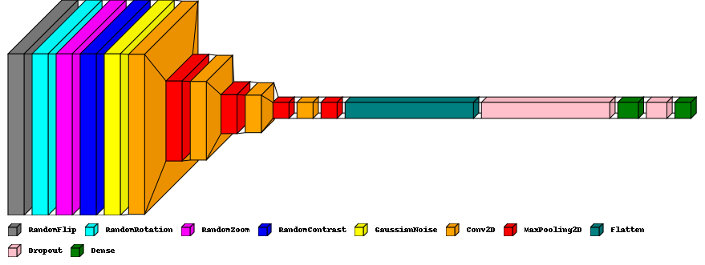

# tf-image-classifier

## Image Classification with Neural Networks
### Group 37: Adam John Brown, Ben Young, Josh Thomas, Matt Rohatynskyj, Thomas McCarthy

#### The goal of this group project is to create a neural network (a machine learning process) to correctly classify groups of flowers from the flowers-102 data set. To develop our neural network we were given two Python libraries to choose from, TensorFlow and PyTorch. We chose to use TensorFlow. After training the neural network and running it on the test data, we achieved a classification accuracy of 52.55\%.

